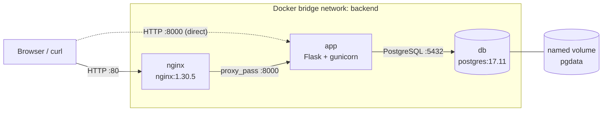

# cutURL

> A small URL shortener running as a Docker Compose stack: **Nginx → Flask (gunicorn) → PostgreSQL**.


[](https://github.com/prashantmodak1804/cutURL/actions/workflows/ci.yml)

- **Author:** Prashant Modak
- **Roll number:** 25051775
- **Track:** A (Ship It)
- **Program:** GFG KIIT Student Chapter, Cloud & DevOps Domain, Foundation Project Task 01
- **Status:** work in progress. This README is updated as each stage is completed.

## About

cutURL is a small URL shortener. You paste a long link into a web page, the app generates a 6-character code, stores the pair in a PostgreSQL database, and returns a short link. Opening the short link redirects you to the original URL. A `/healthz` endpoint returns 200 only when the database is reachable. The app is deliberately small; the focus of the project is the infrastructure around it.

## Contents

[About](#about) · [Features](#features) · [Architecture](#architecture) · [Tech stack](#tech-stack) · [Project structure](#project-structure) · [Getting started](#getting-started) · [Usage and testing](#usage-and-testing) · [Configuration](#configuration) · [API](#api) · [Docker image](#docker-image) · [Compose stack](#compose-stack) · [Troubleshooting](#troubleshooting) · [Status](#status)

## Features

- Paste a long URL, get a 6-character short link; opening it redirects (302) to the original.
- Links are stored in PostgreSQL and survive container restarts.
- `/healthz` returns 200 only when the database is reachable.
- Startup is health-gated: database, then app, then Nginx.
- Configuration comes entirely from a `.env` file; no credentials are committed.

## Architecture

Current local stack:



| Service | Container port | Published on host | Notes |
|---|---|---|---|
| `nginx` | 80 | 80 | Entry point |
| `app` | 8000 | 8000 | Direct access, bypasses Nginx |
| `db` | 5432 | not published | Reachable only on the `backend` network |

## Tech stack

| Layer | Technology |
|---|---|
| App | Python 3.12, Flask 3.1.3, psycopg 3.3.6 (binary), gunicorn 26.2.0 |
| Database | PostgreSQL 17.11 |
| Reverse proxy | Nginx 1.30.5 |
| Containers | Docker Engine, Docker Compose |
| Base image | `python:3.12.14-slim-bookworm` |
| Dev host | Ubuntu Server VM (key-only SSH, UFW firewall) |

All images use pinned tags, never `:latest`.

## Project structure

```
cutURL/
├── app/
│   ├── app.py                # Flask app: routes, DB access, health check
│   ├── requirements.txt      # Pinned dependencies
│   └── templates/index.html  # Front-end page
├── nginx/default.conf        # Reverse proxy config
├── scripts/deploy.sh         # Placeholder
├── .github/workflows/ci.yml  # Lint, then build and push image to GHCR
├── Dockerfile                # Multi-stage image
├── docker-compose.yml        # db + app + nginx
├── .env.example              # Dummy values (committed)
├── .dockerignore
└── .gitignore
```

## Getting started

Requires Docker Engine with the Compose plugin, and Git.

```bash
git clone https://github.com/prashantmodak1804/cutURL.git
cd cutURL
cp .env.example .env
docker compose up -d --build
```

Wait about 40 seconds for the health checks, then:

```bash
docker compose ps          # db and app should show (healthy)
curl -i localhost/healthz  # HTTP/1.1 200 OK
```

Stop the stack:

```bash
docker compose down        # keeps the pgdata volume
docker compose down -v     # also deletes pgdata (all stored links)
```

## Usage and testing

Open `http://<host-ip>/`, paste a URL and press **Shorten**. From the command line:

```bash
curl -s -X POST -d "url=https://example.com" localhost/shorten   # returns the page with the short link
curl -i localhost/<short_code>                                    # 302 to the original URL
curl -i localhost/healthz                                         # 200 OK
```

Observe the running stack:

```bash
docker compose logs -f app
docker compose exec app whoami      # appuser, not root
docker compose exec db psql -U cuturl_user -d cuturl -c "SELECT * FROM links;"
docker images cuturl:dev            # image size
```

Check data persistence:

```bash
curl -s -o /dev/null -X POST -d "url=https://example.com" localhost/shorten
docker compose exec db psql -U cuturl_user -d cuturl -c "SELECT * FROM links;"
docker compose down
docker compose up -d
# after about 40 seconds, run the SELECT again: the rows are still there
```

## Configuration

Copy `.env.example` to `.env` (git-ignored, never commit it).

| Variable | Example | Meaning |
|---|---|---|
| `DB_HOST` | `db` | Database hostname; must match the Compose service name |
| `DB_PORT` | `5432` | PostgreSQL port |
| `DB_NAME` | `cuturl` | Database name |
| `DB_USER` | `cuturl_user` | Database user |
| `DB_PASS` | `cuturl_pass` | Database password; use your own value outside local testing |
| `PORT` | `8000` | Optional; only used when running `python app.py` directly |

Compose passes these to the `app` service through `env_file` and maps `DB_USER`, `DB_PASS` and `DB_NAME` onto the `POSTGRES_*` variables the `db` service needs.

## API

| Route | Method | Description | Responses |
|---|---|---|---|
| `/` | GET | Front-end page | 200 |
| `/shorten` | POST | Form field `url`; stores it under a random 6-character code | 200 |
| `/<short_code>` | GET | Redirects to the stored URL | 302, or 404 if unknown |
| `/healthz` | GET | Runs `SELECT 1` against the database | 200 `OK`, or 500 `DB unreachable` |

The app creates the `links` table (`id`, `short_code` unique, `original_url`) on startup and retries up to 10 times, 2 seconds apart, if the database is not ready.

## Docker image

| Property | Value |
|---|---|
| Build | Two stages: dependencies into a virtualenv, then a slim runtime stage that copies only the venv and `app/` |
| Base | `python:3.12.14-slim-bookworm`, pinned |
| User | `appuser` (UID 10001), non-root |
| Process | `gunicorn`, 2 workers, `--preload`, `--forwarded-allow-ips "*"`, port 8000 |
| Health check | `GET /healthz` on `127.0.0.1:8000` every 30 s (Python standard library, no `curl`) |
| Size | 57.7 MB multi-stage, 64 MB single-stage |

```bash
docker build -t cuturl:dev .
docker run -d --name cuturl --env-file .env -p 8000:8000 cuturl:dev   # needs a reachable PostgreSQL
```

## Compose stack

| Service | Image | Health check | Restart |
|---|---|---|---|
| `db` | `postgres:17.11` (data in the `pgdata` volume) | `pg_isready`, every 5 s | `unless-stopped` |
| `app` | built from `Dockerfile` (`cuturl:dev`) | from the image | `unless-stopped` |
| `nginx` | `nginx:1.30.5`, `nginx/default.conf` mounted read-only | none | `unless-stopped` |

- **Order:** `app` waits for `db` to be healthy, and `nginx` waits for `app` (`depends_on` with `service_healthy`).
- **Networking:** all services share the custom `backend` bridge network and find each other by service name (`db`, `app`). Docker's embedded DNS server resolves those names to container IPs, so no IP address appears in the configuration.
- **Proxy headers:** Nginx sets `Host`, `X-Forwarded-For` to `$remote_addr` (set by Nginx, so clients cannot forge it) and `X-Forwarded-Proto`.

## Troubleshooting

| Symptom | Fix |
|---|---|
| `app` unhealthy right after `up` | Wait about 40 s, then check `docker compose logs app db` |
| `/healthz` returns 500 | Database unreachable; check that `db` is `healthy` in `docker compose ps` |
| Port 80 already in use | Change the host side of the mapping in `docker-compose.yml`, for example `"8080:80"` |
| Changed `DB_PASS`, app cannot log in | PostgreSQL only reads `POSTGRES_PASSWORD` on first initialisation; restore the old value or reset with `docker compose down -v` (deletes data) |

## Status

Work in progress.

| Stage | Scope | Status |
|---|---|---|
| 1 | Ubuntu Server VM | Done |
| 2 | Linux administration and networking | Done |
| 3 | Containerised application | Done |
| 4 | Multi-service Compose stack | Done |
| Further stages | | Not documented yet |
