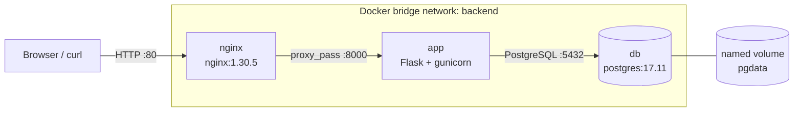
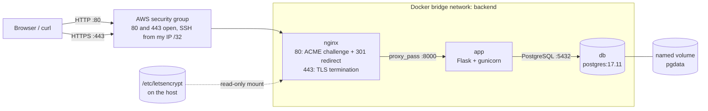
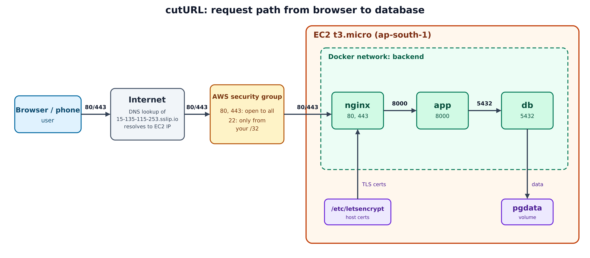

# cutURL

> A small URL shortener running as a Docker Compose stack: **Nginx → Flask (gunicorn) → PostgreSQL**.


[](https://github.com/prashantmodak1804/cutURL/actions/workflows/ci.yml)

- **Author:** Prashant Modak
- **Roll number:** 25051775
- **Track:** A (Ship It)
- **Program:** GFG KIIT Student Chapter, Cloud & DevOps Domain, Foundation Project Task 01
- **Status:** all seven stages and Track A are implemented (see [Status](#status)).

## About

cutURL is a small URL shortener. You paste a long link into a web page, the app generates a 6-character code, stores the pair in a PostgreSQL database, and returns a short link. Opening the short link redirects you to the original URL. A `/healthz` endpoint returns 200 only when the database is reachable. The app is deliberately small; the focus of the project is the infrastructure around it.

The stack runs in two modes: **HTTP only** (the default, works on any machine after a fresh clone) and **HTTPS** (optional, for a public server; see [Enable HTTPS](#enable-https-optional-cloud-only)).

## Contents

[About](#about) · [Features](#features) · [Architecture](#architecture) · [Tech stack](#tech-stack) · [Project structure](#project-structure) · [Getting started](#getting-started) · [Enable HTTPS (optional, cloud only)](#enable-https-optional-cloud-only) · [Usage and testing](#usage-and-testing) · [Configuration](#configuration) · [API](#api) · [Docker image](#docker-image) · [Compose stack](#compose-stack) · [CI pipeline](#ci-pipeline) · [Live deployment](#live-deployment) · [Troubleshooting](#troubleshooting) · [Status](#status)

## Features

- Paste a long URL, get a 6-character short link; opening it redirects (302) to the original.
- Links are stored in PostgreSQL and survive container restarts.
- `/healthz` returns 200 only when the database is reachable.
- Startup is health-gated: database, then app, then Nginx.
- Configuration comes entirely from a `.env` file; no credentials are committed.
- Optional HTTPS through a Compose override file: Let's Encrypt certificate, HTTP to HTTPS redirect (301), proxy headers preserved.
- One-command updates on the server with `scripts/deploy.sh`.

## Architecture

Default local stack (HTTP only):



With the HTTPS override on a cloud server (EC2):



| Service | Container port | Published on host | Notes |
|---|---|---|---|
| `nginx` | 80 | 80 | Entry point; also serves the Let's Encrypt challenge path |
| `nginx` | 443 | 443 (only with `docker-compose.https.yml`) | TLS termination, HTTPS mode only |
| `app` | 8000 | not published | Reachable only through Nginx |
| `db` | 5432 | not published | Reachable only on the `backend` network |



## Tech stack

| Layer | Technology |
|---|---|
| App | Python 3.12, Flask 3.1.3, psycopg 3.3.6 (binary), gunicorn 26.2.0 |
| Database | PostgreSQL 17.11 |
| Reverse proxy | Nginx 1.30.5 |
| TLS certificates | Let's Encrypt via certbot (`certbot/certbot` image), webroot challenge |
| Hostname | Free wildcard DNS, `<ip-with-dashes>.sslip.io` |
| Containers | Docker Engine, Docker Compose |
| CI/CD | GitHub Actions, `ruff` lint, images published to GHCR (`ghcr.io`) |
| Base image | `python:3.12.14-slim-bookworm` |
| Dev host | Ubuntu Server VM (key-only SSH, UFW firewall) |

All images use pinned tags, never `:latest`.

## Project structure

```
cutURL/
├── app/
│   ├── app.py                # Flask app: routes, DB access, health check
│   ├── requirements.txt      # Pinned dependencies
│   └── templates/index.html  # Front-end page
├── nginx/
│   ├── default.conf          # HTTP-only proxy config (default, works on any clone)
│   └── https.conf            # HTTPS config; keeps a YOUR_HOSTNAME placeholder
├── certbot/                  # Created at runtime, git-ignored (ACME challenge files)
│   └── www/
├── scripts/deploy.sh         # Pull, rebuild with HTTPS override, wait for health
├── .github/workflows/ci.yml  # Lint, then build and push image to GHCR
├── Dockerfile                # Multi-stage image
├── docker-compose.yml        # db + app + nginx (HTTP only)
├── docker-compose.https.yml  # Optional override: publishes 443, swaps in https.conf
├── docs/
│   ├── architecture.png      # Architecture diagram
│   └── screenshots/          # Evidence for each stage
├── .env.example              # Dummy values (committed)
├── .dockerignore
└── .gitignore
```

## Getting started

Requires Docker Engine with the Compose plugin, and Git.

```bash
git clone https://github.com/prashantmodak1804/cutURL.git
cd cutURL
cp .env.example .env
docker compose up -d --build
```

Wait about 40 seconds for the health checks, then:

```bash
docker compose ps          # db and app should show (healthy)
curl -i localhost/healthz  # HTTP/1.1 200 OK
```

Stop the stack:

```bash
docker compose down        # keeps the pgdata volume
docker compose down -v     # also deletes pgdata (all stored links)
```

This is the whole local setup. HTTPS is not needed locally and is not enabled by default.

## Enable HTTPS (optional, cloud only)

HTTPS needs a certificate, and a certificate only exists on a server with a public hostname. A committed HTTPS config that pointed at certificate files would break every fresh clone. So the default stack is HTTP only, and HTTPS is a Compose override file added on top: `docker-compose.https.yml` publishes port 443 and mounts `nginx/https.conf` over the default Nginx config. Anyone can stay local (HTTP) or go cloud (HTTPS).

### Prerequisites

- A server with a public IP (for example an AWS EC2 `t3.micro`), with Docker installed and the repository cloned.
- Ports **80 and 443** open in the security group (port 80 is needed to issue and renew the certificate).
- A hostname for that IP. With [sslip.io](https://sslip.io) no setup is needed: for IP `13.233.1.2` the hostname is `13-233-1-2.sslip.io`. If the public IP changes, the hostname changes too, so repeat steps 2 to 5 with the new one.

### Steps

1. Start the normal HTTP stack on the server and confirm it responds:

```bash
   cp .env.example .env        # then set your own values in .env
   mkdir -p certbot/www
   docker compose up -d --build
   curl -i http://YOUR_HOSTNAME/healthz   # HTTP/1.1 200 OK
```

2. Request the certificate **once**. Do not run this in a loop: Let's Encrypt rate-limits failed attempts.

```bash
   docker run --rm \
     -v /etc/letsencrypt:/etc/letsencrypt \
     -v "$PWD/certbot/www:/var/www/certbot" \
     certbot/certbot certonly --webroot -w /var/www/certbot \
     -d YOUR_HOSTNAME --agree-tos -m you@example.com
```

   If it fails, check that the hostname resolves to the server (`dig +short YOUR_HOSTNAME`) and that port 80 is open, then retry once.

3. Edit `nginx/https.conf` and replace `YOUR_HOSTNAME` with your hostname in four places: both `server_name` lines and both certificate paths. The committed file keeps the placeholder; nothing replaces it automatically.

```bash
   nano nginx/https.conf
   grep -n "server_name\|ssl_certificate" nginx/https.conf   # all four lines show your hostname
   grep -c YOUR_HOSTNAME nginx/https.conf                    # prints 0
```

   Keep this edit on the server and do not commit it, because the hostname differs per deployment. If `git pull` complains about this file, run `git stash`, `git pull`, then `git stash pop`.

4. Start the stack with the HTTPS override:

```bash
   docker compose -f docker-compose.yml -f docker-compose.https.yml up -d
```

   Tip: `export COMPOSE_FILE=docker-compose.yml:docker-compose.https.yml` lets you use plain `docker compose ...` for the rest of that shell session.

5. Verify:

```bash
   curl -I http://YOUR_HOSTNAME/           # 301 Moved Permanently, Location: https://YOUR_HOSTNAME/
   curl -i https://YOUR_HOSTNAME/healthz   # 200 OK, no certificate warning
   # shorten a URL in the site, then:
   docker compose -f docker-compose.yml -f docker-compose.https.yml logs app   # "Shortened ... for client <your public IP>"
```

   In a browser, `https://YOUR_HOSTNAME` shows a genuine padlock.

### Deploy script

After the one-time setup above, `scripts/deploy.sh` is the single command for later updates:

```bash
./scripts/deploy.sh; echo "exit code: $?"    # 0 if healthy, 1 if the health check failed
```

It reads the hostname from `nginx/https.conf`, runs `git pull --ff-only`, rebuilds and restarts the stack with the HTTPS override, then checks `https://<hostname>/healthz` up to 30 times, 2 seconds apart. If the endpoint answers it prints "Healthy" and exits 0; otherwise it prints an error and exits 1. It is safe to run twice in a row, because `docker compose up -d` only recreates containers whose image or configuration changed.

### Going back to HTTP only

```bash
docker compose -f docker-compose.yml -f docker-compose.https.yml down
docker compose up -d
```

### Certificate renewal

Let's Encrypt certificates last 90 days. To renew, run certbot again with the same mounts, then reload Nginx. The challenge location stays above the redirect in `nginx/https.conf`, so renewal over port 80 keeps working.

```bash
docker run --rm \
  -v /etc/letsencrypt:/etc/letsencrypt \
  -v "$PWD/certbot/www:/var/www/certbot" \
  certbot/certbot renew
docker compose -f docker-compose.yml -f docker-compose.https.yml exec nginx nginx -s reload
```

## Usage and testing

Open `http://<host-ip>/` (or `https://<hostname>/` in HTTPS mode), paste a URL and press **Shorten**. From the command line:

```bash
curl -s -X POST -d "url=https://example.com" localhost/shorten   # returns the page with the short link
curl -i localhost/<short_code>                                    # 302 to the original URL
curl -i localhost/healthz                                         # 200 OK
```

Observe the running stack:

```bash
docker compose logs -f app
docker compose exec app whoami      # appuser, not root
docker compose exec db psql -U cuturl_user -d cuturl -c "SELECT * FROM links;"
docker images cuturl:dev            # image size
```

Check data persistence:

```bash
curl -s -o /dev/null -X POST -d "url=https://example.com" localhost/shorten
docker compose exec db psql -U cuturl_user -d cuturl -c "SELECT * FROM links;"
docker compose down
docker compose up -d
# after about 40 seconds, run the SELECT again: the rows are still there
```

Check and monitor HTTPS (cloud only; in HTTPS mode every `docker compose` command needs both `-f` flags, or the `COMPOSE_FILE` export from the HTTPS steps):

```bash
curl -I http://YOUR_HOSTNAME/           # 301 redirect to https://
curl -i https://YOUR_HOSTNAME/healthz   # 200 OK over TLS
docker compose logs -f --tail 50 app    # after shortening a URL: "Shortened ... for client <real IP>"
docker compose logs -f --tail 50 nginx  # Nginx access and error logs
docker compose exec nginx nginx -t      # test the Nginx config
sudo ss -tulpn | grep -E ':(80|443)\b'   # listening ports on the host

# certificate issuer and validity dates, as served by Nginx
echo | openssl s_client -connect YOUR_HOSTNAME:443 -servername YOUR_HOSTNAME 2>/dev/null \
  | openssl x509 -noout -subject -issuer -dates

# test renewal without replacing the real certificate
docker run --rm -v /etc/letsencrypt:/etc/letsencrypt -v "$PWD/certbot/www:/var/www/certbot" \
  certbot/certbot renew --dry-run
```

## Configuration

Copy `.env.example` to `.env` (git-ignored, never commit it).

| Variable | Example | Meaning |
|---|---|---|
| `DB_HOST` | `db` | Database hostname; must match the Compose service name |
| `DB_PORT` | `5432` | PostgreSQL port |
| `DB_NAME` | `cuturl` | Database name |
| `DB_USER` | `cuturl_user` | Database user |
| `DB_PASS` | `cuturl_pass` | Database password; use your own value outside local testing |
| `PORT` | `8000` | Optional; only used when running `python app.py` directly |

Compose passes these to the `app` service through `env_file` and maps `DB_USER`, `DB_PASS` and `DB_NAME` onto the `POSTGRES_*` variables the `db` service needs.

HTTPS adds no environment variables; its hostname is set by hand in `nginx/https.conf` (see step 3 of [Enable HTTPS](#enable-https-optional-cloud-only)).

## API

| Route | Method | Description | Responses |
|---|---|---|---|
| `/` | GET | Front-end page | 200 |
| `/shorten` | POST | Form field `url`; stores it under a random 6-character code | 200 |
| `/<short_code>` | GET | Redirects to the stored URL | 302, or 404 if unknown |
| `/healthz` | GET | Runs `SELECT 1` against the database | 200 `OK`, or 500 `DB unreachable` |

The app creates the `links` table (`id`, `short_code` unique, `original_url`) on startup and retries up to 10 times, 2 seconds apart, if the database is not ready.

## Docker image

| Property | Value |
|---|---|
| Build | Two stages: dependencies into a virtualenv, then a slim runtime stage that copies only the venv and `app/` |
| Base | `python:3.12.14-slim-bookworm`, pinned |
| User | `appuser` (UID 10001), non-root |
| Process | `gunicorn`, 2 workers, `--preload`, `--forwarded-allow-ips "*"`, port 8000 |
| Health check | `GET /healthz` on `127.0.0.1:8000` every 30 s (Python standard library, no `curl`) |
| Size | 57.7 MB multi-stage, 64 MB single-stage |

```bash
docker build -t cuturl:dev .
docker run -d --name cuturl --env-file .env -p 8000:8000 cuturl:dev   # needs a reachable PostgreSQL
```

## Compose stack

| Service | Image | Health check | Restart |
|---|---|---|---|
| `db` | `postgres:17.11` (data in the `pgdata` volume) | `pg_isready`, every 5 s | `unless-stopped` |
| `app` | built from `Dockerfile` (`cuturl:dev`) | from the image | `unless-stopped` |
| `nginx` | `nginx:1.30.5`, `nginx/default.conf` and `certbot/www` mounted read-only | none | `unless-stopped` |

- **Order:** `app` waits for `db` to be healthy, and `nginx` waits for `app` (`depends_on` with `service_healthy`).
- **Networking:** all services share the custom `backend` bridge network and find each other by service name (`db`, `app`). Docker's embedded DNS server resolves those names to container IPs, so no IP address appears in the configuration.
- **Proxy headers:** Nginx sets `Host`, `X-Forwarded-For` to `$remote_addr` (set by Nginx, so clients cannot forge it) and `X-Forwarded-Proto`. The app reads `X-Forwarded-For` and logs the real visitor IP when a link is shortened or opened.
- **HTTPS override:** `docker-compose.https.yml` adds `443:443`, mounts `nginx/https.conf` over `default.conf`, and mounts the host's `/etc/letsencrypt` read-only. Both Nginx configs serve `/.well-known/acme-challenge/` from `./certbot/www`, so certbot can prove control of the hostname over port 80.

## CI pipeline

`.github/workflows/ci.yml` runs on every push to `main` (status badge at the top of this README).

| Job | What it does |
|---|---|
| `lint` | `ruff check app/`; if it fails, the build job does not run |
| `build-and-push` | Needs `lint`. Logs in to GHCR with the built-in `GITHUB_TOKEN`, builds the image and pushes it twice: `latest` and the commit SHA |

The workflow has `packages: write` permission, which GHCR needs for the push. The SHA tag identifies exactly which commit an image was built from, so a deployment can be traced and rolled back to a known build; `latest` always moves to the newest push and does not say what is running.

```bash
docker pull ghcr.io/prashantmodak1804/cuturl:latest
docker pull ghcr.io/prashantmodak1804/cuturl:<commit-sha>
```

If the package is private, run `docker login ghcr.io` first. The pipeline builds and pushes the image only; it does not deploy to the server.

## Live deployment

| Item | Value |
|---|---|
| Live URL | https://15-135-115-253.sslip.io |
| Hostname | 15-135-115-253.sslip.io |
| Cloud resources torn down on | _to be filled in after report & video submission_ |

## Troubleshooting

| Symptom | Fix |
|---|---|
| `app` unhealthy right after `up` | Wait about 40 s, then check `docker compose logs app db` |
| `/healthz` returns 500 | Database unreachable; check that `db` is `healthy` in `docker compose ps` |
| Port 80 already in use | Change the host side of the mapping in `docker-compose.yml`, for example `"8080:80"` |
| Changed `DB_PASS`, app cannot log in | PostgreSQL only reads `POSTGRES_PASSWORD` on first initialisation; restore the old value or reset with `docker compose down -v` (deletes data) |
| Certificate request fails | Check that the hostname resolves to the server (`dig +short YOUR_HOSTNAME`), port 80 is open, and the HTTP stack is running. Retry once; do not loop, Let's Encrypt rate-limits failures |
| Nginx exits or restarts with the HTTPS override | `nginx/https.conf` still contains `YOUR_HOSTNAME`, or the certificate does not exist yet. Check `docker compose logs nginx` and `sudo ls /etc/letsencrypt/live/` |
| HTTPS times out from outside | Port 443 is not open in the security group |
| Edited `nginx/https.conf` but nothing changed | Single-file mounts can keep showing the old file inside the container; run `docker compose restart nginx` |
| No client IP lines in `docker compose logs app` | The app logs the visitor IP only when a link is shortened or opened; shorten a URL first |
| `deploy.sh` ends with "Health check failed" | `nginx/https.conf` still has the placeholder, the certificate is missing, or the stack is unhealthy; check `docker compose -f docker-compose.yml -f docker-compose.https.yml logs nginx app` |
| Fresh clone fails to start Nginx | The HTTPS override is being used without a certificate; use plain `docker compose up -d` |

## Status

All seven stages and Track A are implemented.

| Stage | Scope | Status |
|---|---|---|
| 1 | Ubuntu Server VM | Done |
| 2 | Linux administration and networking | Done |
| 3 | Containerised application | Done |
| 4 | Multi-service Compose stack | Done |
| 5 | AWS account and EC2 | Done |
| 6 | Deploy to the cloud | Done |
| 7 | Continuous integration and image delivery | Done (optional automatic deployment to EC2 not added) |
| Track A | Reverse proxy, HTTPS (opt-in override), `scripts/deploy.sh` | Done |
